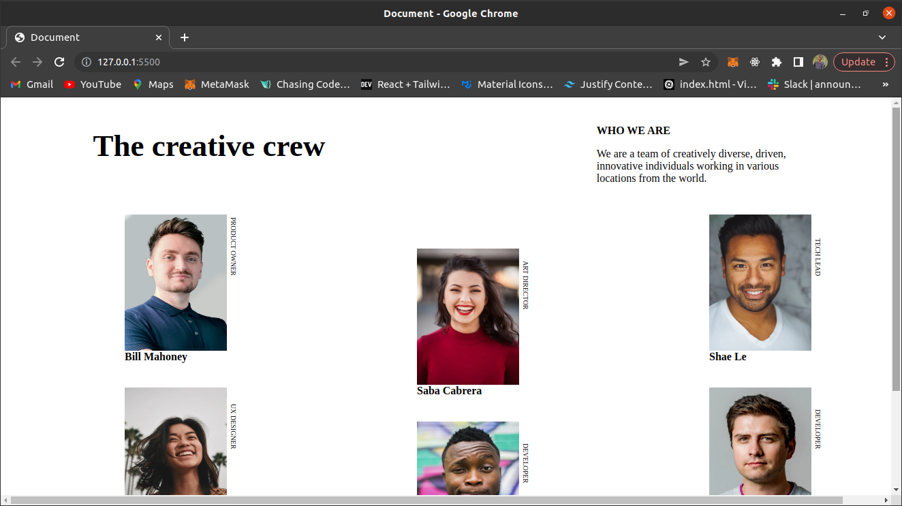
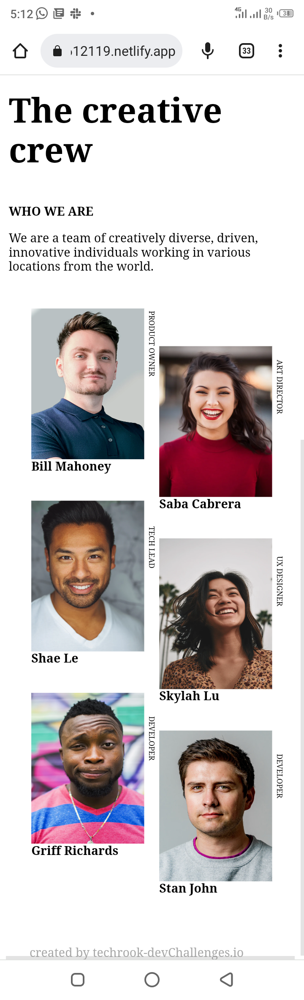

<!-- Please update value in the {}  -->

<h1 align="center">my team page</h1>

   Solution for a challenge from  <a href="http://devchallenges.io" target="_blank">Devchallenges.io</a>.

  <h3>
    <a href="https://reliable-manatee-612119.netlify.app/">
      A figma design of design
    </a>
     | 
    <a href="https://reliable-manatee-612119.netlify.app/">
      my replicate of the design 
    </a>
     | 
    <a href="https://devchallenges.io/challenges/hhmesazsqgKXrTkYkt0U">
      Inspired by devChallenge.io
    </a>
  </h3>

<!-- TABLE OF CONTENTS -->

## Table of Contents

- [Overview](#overview)
  - [Built With](#built-with)
- [Features](#features)
- [Contact](#contact)
- [Acknowledgements](#acknowledgements)

<!-- OVERVIEW -->

## Overview

 
## mobile view

  <a> https://reliable-manatee-612119.netlify.app/</a> is web design clone from devChallenge.io , it was a very exciting project cause i have not done anything like this before , so during the project i was able to learn css writing mode and improve my grid styling. if you have any suggestion you can contact me (contact information is at bottom)

### Built With

<!-- This section should list any major frameworks that you built your project using. Here are a few examples.-->

- [HTML](https://developer.mozilla.org/en-US/docs/Learn/Getting_started_with_the_web/HTML_basics)
- [SASS](https://sass-lang.com/)

## Features

<!-- List the features of your application or follow the template. Don't share the figma file here :) -->

This application/site was created as a submission to a [DevChallenges](https://devchallenges.io/challenges) challenge. The [challenge](https://devchallenges.io/challenges/hhmesazsqgKXrTkYkt0U) was to build an application to complete the given user stories.

## Acknowledgements

<!-- This section should list any articles or add-ons/plugins that helps you to complete the project. This is optional but it will help you in the future. For exmpale -->

- [Steps to replicate a design with only HTML and CSS](https://devchallenges-blogs.web.app/how-to-replicate-design/)

## Contact

- GitHub [@techrook](https://{github.com/techrook})
- Twitter [@itohowo23](https://{twitter.com/itohowo23})
